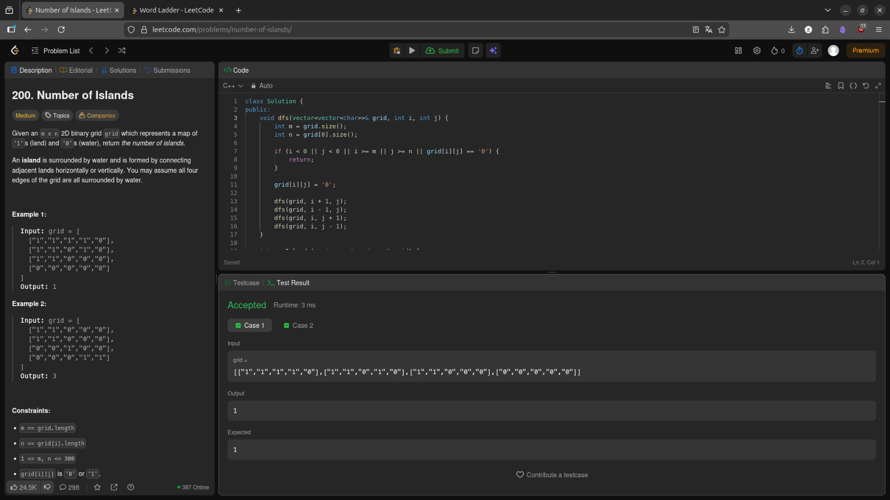
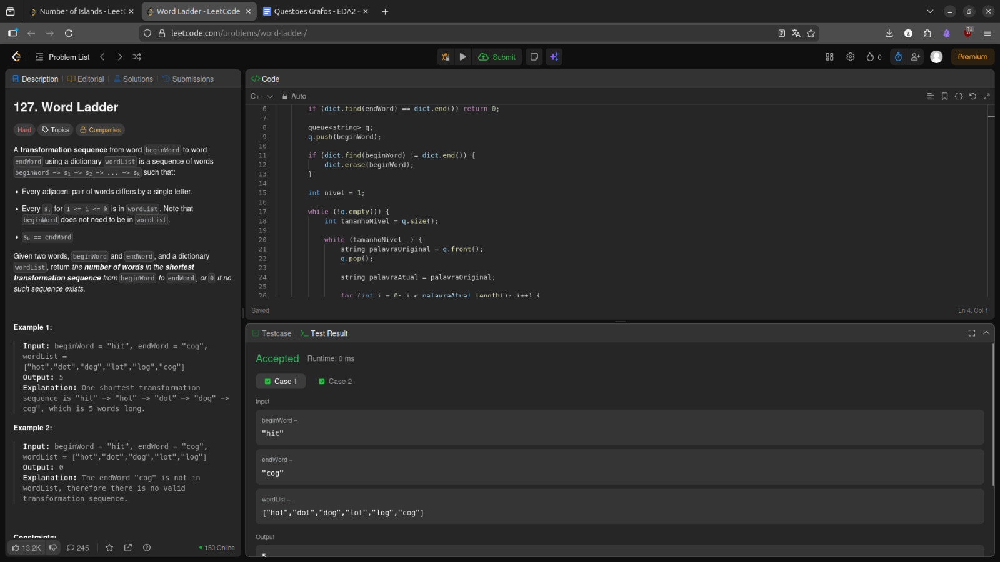
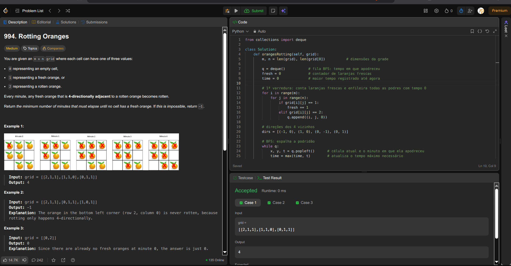
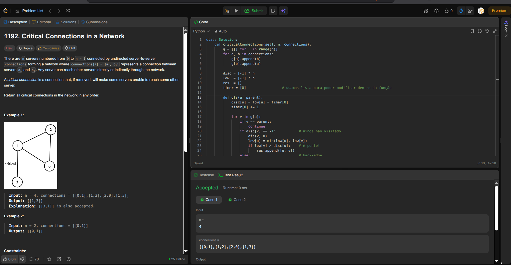

#  Projeto: Estruturas de Dados — Grafos e Busca (Graphs & Search)

## Alunos

| Matrícula | Nome |
|-----------|------|
| 21/1062240 | Mateus Bastos dos Santos |
| 21/1062320 | Miguel Arthur Oliveira de Lima |

---

## Descrição do Projeto

Este projeto foi desenvolvido como parte do segundo trabalho da disciplina de **Estruturas de Dados e Algoritmos II (EDA2)**, com foco em **estruturas baseadas em grafos e técnicas de busca**.

O objetivo é compreender o funcionamento, a implementação e a aplicação prática de **algoritmos fundamentais de grafos**, utilizando exercícios da plataforma **LeetCode** para validação.

---

## Exercícios Selecionados

> Foram selecionados **2 exercícios de nível Médio** e **2 exercícios de nível Difícil**, todos relacionados a grafos, conectividade, busca em largura (BFS), busca em profundidade (DFS) e teoria de redes.

| Exercício | Dificuldade | Estrutura Principal |
|-----------|-------------|---------------------|
| [01. Number of Islands (200)](https://leetcode.com/problems/number-of-islands/) | Médio | Grid Graph / DFS / BFS |
| [02. Word Ladder (127)](https://leetcode.com/problems/word-ladder/) | Difícil | BFS / Graph Construction |
| [03. Rotting Oranges (994)](https://leetcode.com/problems/rotting-oranges/) | Médio | BFS Multi-Fonte / Grid |
| [04. Critical Connections in a Network (1192)](https://leetcode.com/problems/critical-connections-in-a-network/) | Difícil | Graph / DFS / Tarjan (Bridges) |

---

# Exercícios Desenvolvidos

---

## 200. Number of Islands (Médio)

**Autor:** Miguel Arthur   

### Conceito
O objetivo é determinar quantas **ilhas** existem em uma matriz onde '1' representa terra e '0' representa água.  
Uma ilha é formada por células conectadas **verticalmente ou horizontalmente**.

A solução utiliza **busca em profundidade (DFS)** ou **busca em largura (BFS)** para percorrer cada componente conectado.

### Técnicas Utilizadas
- Exploração de vizinhos em grid  
- DFS/BFS para marcar território visitado  
- Contagem de componentes conectados  

[Link do Exercício no LeetCode](https://leetcode.com/problems/number-of-islands/)

---

## 127. Word Ladder (Difícil)

**Autor:** Miguel Arthur   

### Conceito
O desafio consiste em transformar uma palavra inicial em uma palavra final, alterando **apenas 1 letra por vez**, desde que cada nova palavra pertença ao dicionário fornecido.  
O objetivo é calcular o **menor número de transformações possíveis**.

A solução utiliza **BFS**, tratando palavras como vértices de um grafo implícito.

### Técnicas Utilizadas
- Construção de grafo implícito baseado em padrões  
- BFS para menor caminho em grafos não ponderados  
- Otimização com hashing de padrões intermediários  

[Link do Exercício no LeetCode](https://leetcode.com/problems/word-ladder/)

---

## 994. Rotting Oranges (Médio)

**Autor:** Mateus Bastos   

### Conceito
Cada laranja podre espalha a podridão para laranjas frescas **adjacentes (4-direções)** a cada minuto.  
O problema exige determinar **quanto tempo todas as laranjas levarão para apodrecer**, ou retornar -1 se alguma ficar isolada.

A solução utiliza **BFS com múltiplas fontes**, iniciando a fila com todas as laranjas podres do grid.

### Técnicas Utilizadas
- BFS multi-fonte  
- Processamento em camadas (nível por minuto)  
- Detecção de células inalcançáveis  

[Link do Exercício no LeetCode](https://leetcode.com/problems/rotting-oranges/)

---

## 1192. Critical Connections in a Network (Difícil)

**Autor:** Mateus Bastos   

### Conceito
Dado um grafo não direcionado representando conexões de rede, o objetivo é encontrar **arestas críticas** (bridges).  
Uma aresta é crítica se, ao removê-la, o grafo deixa de ser totalmente conectado.

A solução utiliza o **algoritmo de Tarjan**, baseado em DFS, que calcula tempos de descoberta e o menor "low-link" alcançável.

### Técnicas Utilizadas
- Teoria de grafos: Bridges  
- DFS + Tarjan (low-link values)  
- Representação de grafo com lista de adjacência  

[Link do Exercício no LeetCode](https://leetcode.com/problems/critical-connections-in-a-network/)

---

## Como Validar os Exercícios

### Passo 1: Acessar o LeetCode
1. Acesse: https://leetcode.com  
2. Crie uma conta ou faça login.

### Passo 2: Abrir o Exercício
1. Pesquise pelo número (ex: “200” ou “1192”)  
2. Ou clique nos links fornecidos acima.

### Passo 3: Submeter a Solução
> 1. Utilize **C++** para todos os exercícios.  
> 2. Copie o código da sua solução local.  
> 3. Cole no editor do LeetCode.  
> 4. Clique em **Run** e depois **Submit**.

---

## Imagens do Projeto

### Exercício 200 — Number of Islands

---

### Exercício 127 — Word Ladder

---

### Exercício 994 — Rotting Oranges

---

### Exercício 1192 — Critical Connections

---

## 🎥 Vídeo

<h2 align="center"> Apresentação – Grafos e Algoritmos de Busca</h2>

Explicamos todos os códigos implementados na plataforma LeetCode, descrevendo a lógica dos algoritmos de busca e teoria dos grafos aplicada em cada exercício.

  <table>
    <tr>
      <td align="center"><b>Vídeo 01</b></td>
    </tr>
    <tr>
      <td align="center">
        <a href="https://www.youtube.com/embed/W_YO7TrVseg" target="_blank">
          Apresentação — Grafos - Estruturas de Dados — EDA II — UnB FCTE
        </a>
      </td>
    </tr>
  </table>

---

**Disciplina:** Estruturas de Dados e Algoritmos II — Universidade de Brasília  
**Período:** 2025.2
